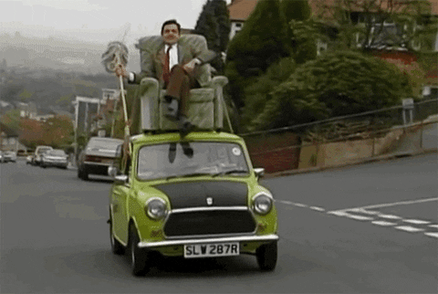
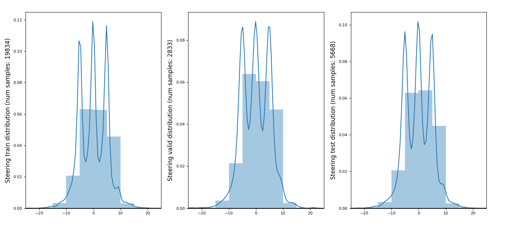
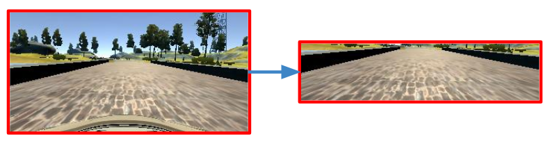
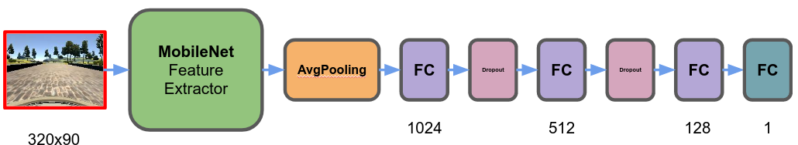
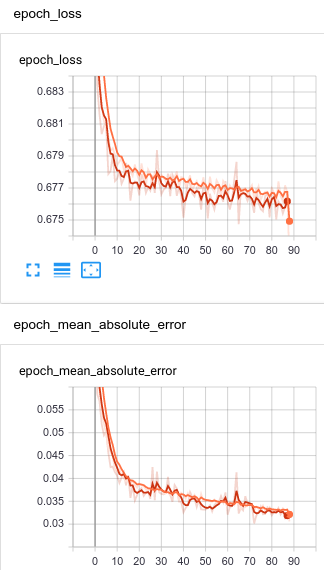
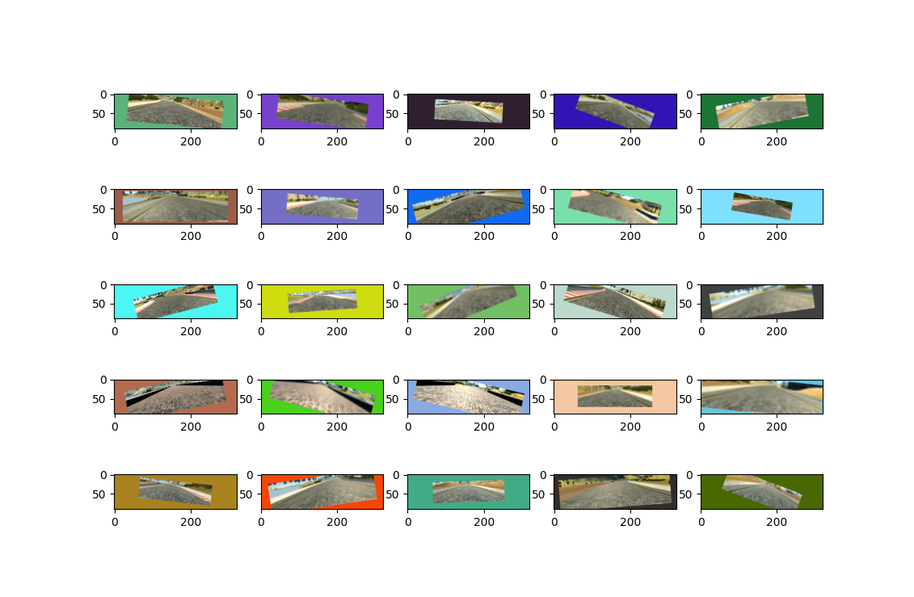

## Autonomous driving

 

This project is focus into create and algorithm that copy the movements of a real driver. In this case the network only predict the steering of the wheels.

### Project structure:

The structure of the project is the following:

- **train.py**: script that train a model.
- **model_lib.py**: the definition of the network architecture.
- **explore.py**: allow to visualize the distribution of steering between splits.
- **drive.py**: drive the simulator using th neural network.
- **video.py**: create video using frames gived by drive.py.
- *dataset*: folder that contains dataset.
- *logs*: tensorboard logs of the training network.
- *checkpoints*: checkpoints of the current training.
- *final_model*: videos and model checkpoint.

### Data exploration:

The first step is to explore the data obtained by the simulator.

The simulator return frames and csv that have:

- center
- left
- right
- steering
- (another date non-relevant for this training).

The first step is create an unique dataset using different:

- **udacity** data.
- **center_line** (using my own data obtained in the simulator).

(I have found bugs into simulator produced by language system and "." delimiter for floating values. [More info](https://knowledge.udacity.com/questions/101662?utm_campaign=ret_600_auto_ndxxx_knowledge-answer-created_na&utm_source=blueshift&utm_medium=email&utm_content=ret_600_auto_ndxxx_knowledge-answer-created_na&bsft_clkid=4a2e455e-b165-483e-a4d4-de0953498ec2&bsft_uid=a03660db-e788-4a75-bca3-50560a0abb49&bsft_mid=c696d127-9303-42e0-8729-2f6147903173&bsft_eid=22b8f7b6-5eac-66ee-cf9f-0d5b86b9fddc&bsft_txnid=dfd71933-15b5-4220-94b6-819c5bb22057&bsft_mime_type=html&bsft_ek=2020-04-05T00%3A02%3A02Z#101800))

When the unique dataset is created, I plot the steering distribution using the different splits: train, test, validation. First to understand the distribution of the date and secondly to sense the possible training problems.

### Data normalization and adaptation:

In order to focus the model into the important area of the image, the image is cropped:

Also I use the mobilenet normalization using `preprocess_input` function. Using the same normalization as the pretrained imagenet weights, the network can use easily the firsts layers practically without changes.

### Model Architecture:

My model is based into mobilenet architecture. ¿Why?

- Is very light, ideal for a realtime problem. The separable convolutions and group convolutions in this case is a must.
- Have a good pretrained weights model from imagenet.
- Have a good gradient flow.

The architecture of my network uses the mobilenet as a feature extractor.

- MobileNet: As a feature extractor.
- AvgMeanPooling: To condensate the spatial information.
- FC + ReLU + Dropout: 1024 output neurons.
- FC + ReLU + Dropout: 512 output neurons.
- FC + ReLU: 128 output neurons.
- FC + Sigmoid: 1 neuron.

¿Why use sigmoid as output? Because the trained information are constraint between -25 to 25 degrees, this limit range can be easily represented by sigmoid function. The sigmoid function have a domain between 0-1.

The another implication is because the combination between sigmoid and binary cross entropy are very stable in terms of gradient.

### Train strategy:

The learning is very "common", I use a generator to:

- Get image, steering pair from dataset.
- Apply data augmentation to the image and steering (detailed in the next section).
- Normalize image and steering to the correct range for the model architecture.

To validate the model improvement I use the validation set at the end of each epoch. Also I mean absolute error, because is more easy to view the improvement.

I have not noticed learning problems in the model.

When using a dropout sometimes it may seem that in the training split there is no learning as good as in validation. It may seem strange but it is very consistent since it is responsible for killing neurons randomly.

### Detailed Data-augmentation:

The data-augmentation contain differents transformations:

- Gaussian Blur.
- Contrast changes.
- Affine transform with different colors in the background.
- Horizontal mirror (also change the steering sign).
- Jitter into the steering labeled to avoid overfitting (label noise).

### Final results:

The following videos show the behavior into autonomous simulator mode:
* Internal view: final_model/video_internal.mp4.
* External view (as simulator view): final_model/video_external.mp4.

